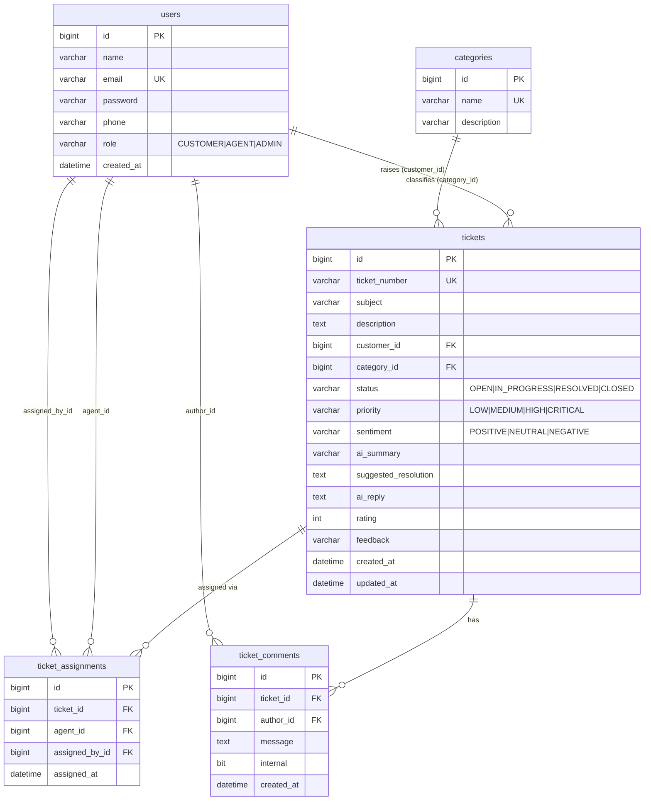

# Database ER Diagram

Paste the block below into https://mermaid.live to export PNG/SVG for submission
(or run the app once and use MySQL Workbench > Database > Reverse Engineer).

```mermaid
erDiagram
    users ||--o{ tickets : "raises (customer_id)"
    categories ||--o{ tickets : "classifies (category_id)"
    tickets ||--o{ ticket_assignments : "assigned via"
    users ||--o{ ticket_assignments : "agent_id"
    users ||--o{ ticket_assignments : "assigned_by_id"
    tickets ||--o{ ticket_comments : "has"
    users ||--o{ ticket_comments : "author_id"

    users {
        bigint id PK
        varchar name
        varchar email UK
        varchar password
        varchar phone
        varchar role "CUSTOMER|AGENT|ADMIN"
        datetime created_at
    }
    categories {
        bigint id PK
        varchar name UK
        varchar description
    }
    tickets {
        bigint id PK
        varchar ticket_number UK
        varchar subject
        text description
        bigint customer_id FK
        bigint category_id FK
        varchar status "OPEN|IN_PROGRESS|RESOLVED|CLOSED"
        varchar priority "LOW|MEDIUM|HIGH|CRITICAL"
        varchar sentiment "POSITIVE|NEUTRAL|NEGATIVE"
        varchar ai_summary
        text suggested_resolution
        text ai_reply
        int rating
        varchar feedback
        datetime created_at
        datetime updated_at
    }
    ticket_assignments {
        bigint id PK
        bigint ticket_id FK
        bigint agent_id FK
        bigint assigned_by_id FK
        datetime assigned_at
    }
    ticket_comments {
        bigint id PK
        bigint ticket_id FK
        bigint author_id FK
        text message
        bit internal
        datetime created_at
    }
```
